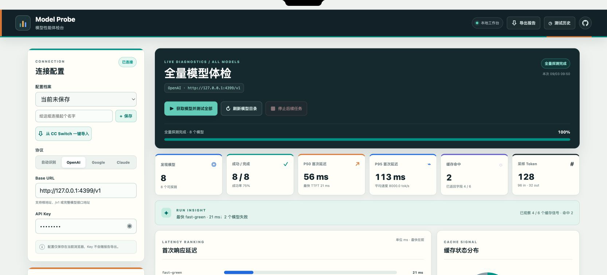
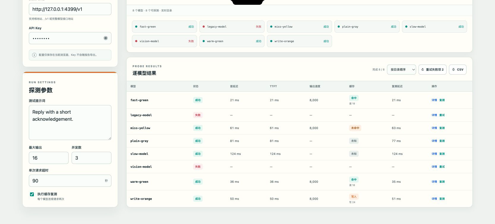
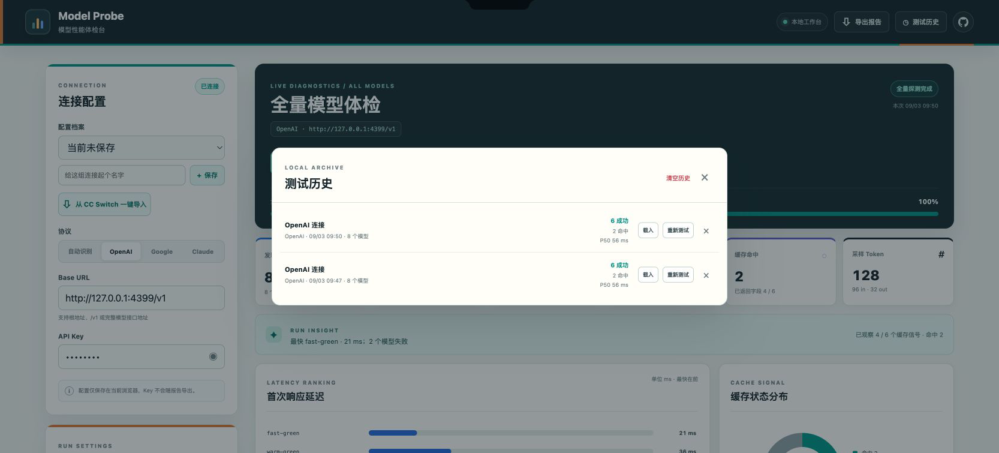

# Model Probe

本地运行的 LLM 接口模型探测工具，支持：

- OpenAI-compatible Chat Completions 协议
- Google Gemini Generative Language 原生协议
- Anthropic Claude Messages 原生协议
- 可按列表接口自动识别 OpenAI、Google 或 Claude 协议
- 按 Base URL 和 API Key 获取模型列表
- 一键获取并批量测量全部可探测模型的总延迟、流式 TTFT、输出速度
- 可按模型名称和状态筛选结果，并按延迟、TTFT、速度或名称排序
- 支持重试失败项、单模型复测，以及 JSON / CSV 报告导出（不包含 API Key）
- 读取上游缓存 usage，并可对每个模型连续请求两次观察 warm cache
- 可设置并发数、最大输出和单次请求超时，并汇总采样 Token
- 在当前浏览器保存多组连接配置
- macOS 本机可从 CC Switch 一键导入已有连接配置
- 保存最近 12 次运行结果，可载入历史或重新测试
- 用延迟排行、TTFT 构成和缓存状态分布图快速比较结果
- 保存模型目录缓存，在列表接口暂时不可用时提供 24 小时内的兜底目录

## 界面预览

### 全量体检总览



### 逐模型结果与缓存状态



### 测试历史



## 运行

需要 Node.js 18 或更高版本：

```bash
npm run dev
```

然后打开 <http://127.0.0.1:4173>。

也可以指定端口：

```bash
MODEL_PROBE_PORT=4300 npm run dev
```

## macOS 应用

需要在 macOS 上构建未签名的 Apple Silicon `.app`：

```bash
npm install
npm run package:mac
```

产物位于 `dist/mac-arm64/Model Probe.app`，双击即可启动。应用会在本机随机端口启动服务，退出时自动关闭；首次分发给其他 Mac 时需要使用 Apple Developer 证书签名和公证。

## 使用

1. 选择协议，输入 Base URL 和 API Key；不确定协议时可选择“自动识别”，也可以给连接配置命名并保存。
2. 点击“获取模型并测试全部”。工具会先调用对应协议的模型列表接口，再自动测试全部可探测模型；自动识别会在列表接口成功后锁定实际协议。
3. 在左侧调整提示词、输出上限、并发数、超时和缓存复测开关。
4. 通过图表和逐模型结果查看延迟、TTFT、速度、Token 和缓存 usage；可以搜索、筛选、排序，或重试失败项和复测单个模型。
5. 顶部“测试历史”可以载入旧结果或重新测试；“导出报告”和结果区的 CSV 按钮可导出当前目录与结果，导出内容不包含 API Key。
6. 在 macOS 上点击“从 CC Switch 一键导入”，工具会读取 CC Switch 中有完整地址和 Key 的 Claude、Gemini、Codex 配置；重复导入会更新已有档案而不会创建重复项。

默认开启缓存复测，会对每个模型发送两次相同请求。第二次请求的缓存 token 由上游响应决定；如果上游没有返回缓存字段，界面会显示“未知”。模型目录缓存只用于列表接口失败时兜底，实际探测请求不会读取本地响应缓存。

## URL 示例

| 协议 | Base URL 示例 |
| --- | --- |
| OpenAI | `https://api.openai.com/v1` |
| Google | `https://generativelanguage.googleapis.com/v1beta` |
| Claude | `https://api.anthropic.com/v1` |

对于 OpenAI-compatible 中转服务，填写其 `/v1` 地址即可。部分服务不实现 `/models` 或不支持流式输出，工具会在有限范围内回退到普通 JSON 请求。

## 缓存口径

缓存状态不是所有协议都能通过一个统一接口查询：

- OpenAI：读取 `cached_tokens` 及其 token details。
- Claude：读取 `cache_read_input_tokens` 和 `cache_creation_input_tokens`。
- Google：读取 `cachedContentTokenCount`。

缓存复测只是观察真实上游 usage 的辅助测试，不会把“延迟变低”当作缓存命中的证据。Google 原生 Prompt Cache 需要供应商支持并在请求中引用缓存资源，本工具目前只读取响应中的缓存 usage。

## 本地保存与安全

配置档案（包括 API Key）和运行历史只保存在当前浏览器的 `localStorage`，不会上传到 Model Probe 以外的服务；探测时 Key 仍会由本机服务转发给你填写的上游地址。浏览器中的本地存储没有额外加密，请不要在共享电脑或不可信的公网部署实例中保存 Key。

CC Switch 导入仅支持 macOS 本机：需要 CC Switch 已运行过、`~/.cc-switch/cc-switch.db` 存在，并且系统提供 `sqlite3` 命令。导入内容包含 API Key，会按上述规则保存到当前浏览器本地。
